# **Sistema de Agenda Digital para Escolas de Ensino Fundamental**

[ProtoType Figma ](https://www.figma.com/file/bF5PLefvs92YJSwXXTEfyM/Agenda-Escola-Digital?type=design&node-id=1%3A2&mode=design&t=xJBBwoKgGIx7ncJ0-1)

### **Objetivo:**

- **Melhorar a comunicação entre a escola, os alunos e seus responsáveis.**
- **Otimizar o gerenciamento de eventos, tarefas e informações relevantes.**
- **Facilitar o acesso a informações essenciais para o bom funcionamento da escola.**

---

### **Justificativas:**

- **A comunicação eficiente é fundamental para o sucesso educacional dos alunos.**
- **A automação de processos reduz a carga administrativa dos professores e funcionários.**
- **A centralização das informações simplifica o acesso e evita perdas de dados.**

---

## **Público**-alvo

- **Alunos, pais e responsáveis.**
- **Professores e funcionários da escola.**

---

### **Impacto Esperado:**

**Alunos:** Facilitação do acesso às informações acadêmicas, eventos e tarefas, incentivando a participação ativa na vida escolar.

**Pais:** Melhoria na comunicação com a escola, possibilitando o acompanhamento mais próximo do desempenho e atividades dos
filhos.

**Professores:** Otimização do gerenciamento de tarefas, eventos e comunicação, permitindo um foco maior no processo educacional.

**Criar uma experiência integrada e eficiente para a comunidade escolar, promovendo uma colaboração mais próxima e uma gestão mais
eficaz das atividades escolares.**

### **Requisitos Funcionais:**

---

**Cadastro de Usuários:** O sistema deve permitir que alunos, pais e professores se cadastrem e criem perfis de usuário.

**Gerenciamento de Eventos:** **O sistema deve permitir que professores e administradores criem e gerenciem eventos escolares.**

**Gerenciamento de Tarefas: **O sistema deve permitir que professores atribuam tarefas aos alunos e acompanhem seu progresso.

**Comunicação:** O sistema deve facilitar a comunicação entre alunos, pais e professores.

**Acesso a Informações Importantes:** O sistema deve fornecer um meio para professores e administradores compartilharem
informações importantes com alunos e pais.

---

**Requisitos Não Funcionais:**

**Segurança:** **O sistema deve proteger as informações pessoais dos usuários e garantir que apenas usuários autorizados tenham
acesso a determinadas informações.**

**Desempenho:** O sistema deve ser capaz de suportar **muitos usuários simultâneos** sem degradação do desempenho.

**Usabilidade:** O sistema deve ser fácil de usar e intuitivo, com uma interface de usuário clara e eficiente.

**Compatibilidade\*\***:\*\* O sistema deve ser compatível com vários dispositivos e navegadores.

---

## **Especificação Básica para API:**

## Métodos HTTP: GET: Obter informações de usuários.

### **Eventos Escolares**

- **Endpoint:** `/eventos`
- **Métodos HTTP:**
  - `GET`: Obter informações sobre eventos escolares.

```json
{
	"nome": "Feira de Ciências",
	"descricao": "Apresentação de projetos científicos",
	"data": "2024-05-15",
	"horario": "14:00",
	"local": "Salão Principal"
}
```

### **Tarefas Escolares**

**Endpoint:** `/tarefas`

**Métodos HTTP:**

- `GET`: Obter informações sobre tarefas escolares.

**Parâmetros:**

- `GET`: `id` (identificador da tarefa).

**Exemplo de resposta (GET):**

```json
{
	"id": 1,
	"descricao": "Resolver exercícios de matemática",
	"prazo": "2024-04-30",
	"disciplina": "Matemática"
}
```

---

## Considerações de Segurança

### **Validação de Parâmetros:**

- Mesmo em operações de leitura (GET), é aconselhável validar os parâmetros de consulta para garantir que estejam no formato
  esperado e não possam ser explorados. Isso pode incluir a validação do tipo de dados, faixas aceitáveis, etc.

### **Autenticação e Autorização:**

- Mesmo que a API seja apenas de leitura, considerar a implementação de autenticação para verificar a identidade do usuário. Isso
  pode ajudar a controlar quem tem acesso às informações. Além disso, você pode implementar autorização para garantir que apenas
  usuários autorizados possam acessar determinadas informações.

### **Segurança da Infraestrutura:**

- Certifique-se de que a infraestrutura que suporta a API esteja configurada com práticas de segurança adequadas, como firewalls,
  atualizações regulares, e configurações seguras do servidor.

### **Monitoramento e Logs:**

- Implemente mecanismos de monitoramento e logs para detectar atividades suspeitas. Isso pode ajudar na identificação de
  tentativas de exploração mesmo em endpoints de leitura.

## BPMN

 
 
 

